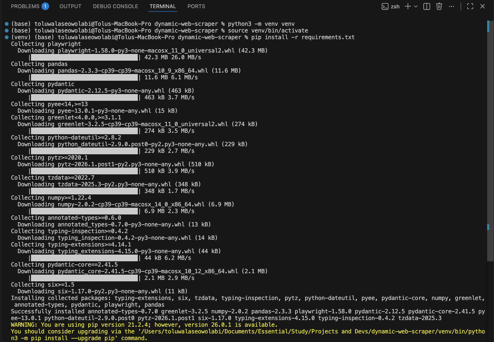
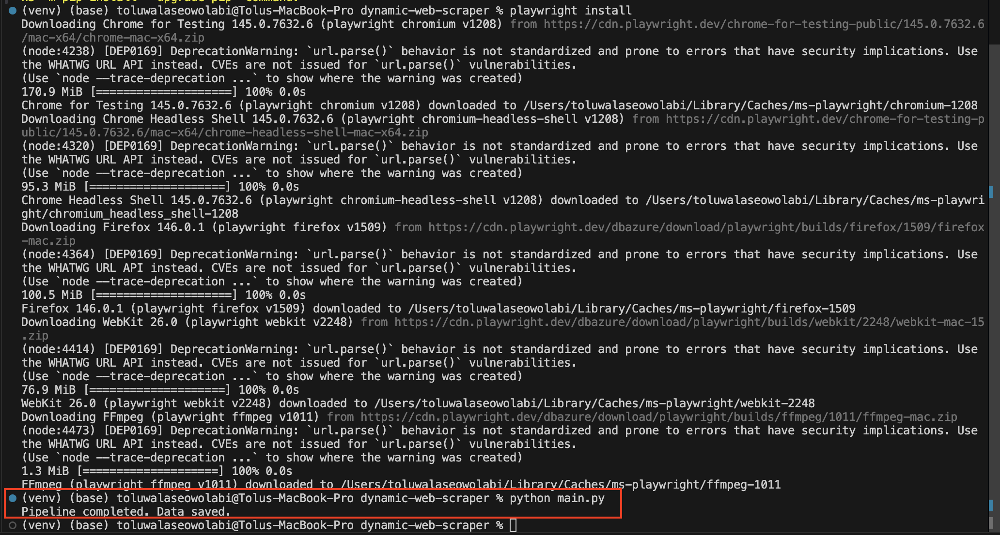
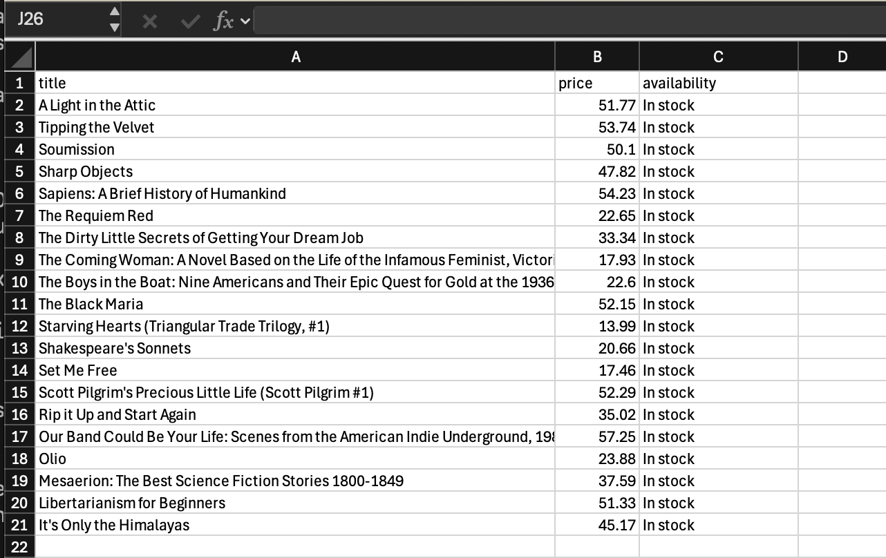

# Dynamic Web Scraper Pipeline (Playwright + Validation)

## Overview

This project demonstrates a production-style data extraction pipeline for JavaScript-rendered websites.

It covers:

* Dynamic web scraping using Playwright
* Data parsing and normalization
* Schema validation with Pydantic
* Export to structured formats (JSON, CSV)

This simulates real-world scraping workflows used in data engineering and automation systems.

---

## Tech Stack

* Python 3.9+
* Playwright (browser automation for JS-heavy sites)
* Pandas (data transformation)
* Pydantic (data validation)

---

## Architecture

Scraper → Raw Data → Parser → Validator → Clean Output

---

## Features

* Handles JavaScript-rendered content
* Extracts structured data from dynamic DOM elements
* Cleans and normalizes raw data
* Validates schema and enforces data integrity
* Exports clean datasets (CSV)

---

## Project Structure

```
scraper/
  ├── scraper.py      # Data extraction logic
  ├── parser.py       # Data cleaning & transformation
  ├── validator.py    # Schema validation

data/
  ├── raw.json
  ├── cleaned.csv

main.py               # Pipeline orchestrator
```

---

## Installation

```bash
git clone https://github.com/toluowo/dynamic-web-scraper.git
cd dynamic-web-scraper

pip install -r requirements.txt
playwright install
```

---

## Run the Pipeline

```bash
python main.py
```

---

## Output

* Raw scraped data → `data/raw.json`
* Clean validated dataset → `data/cleaned.csv`

---

## Validation Logic

* Ensures non-empty titles
* Enforces positive numeric pricing
* Filters invalid or malformed records

---

## Sample Output

### Terminal Execution





### Clean Dataset Preview



---

## Future Improvements

* Async scraping (parallelization)
* Proxy rotation support
* Retry & fault tolerance
* Deployment as API or scheduled job
* Integration with Apify / cloud scraping pipelines

---

## Why This Matters

With this project, you demonstrate the ability to:

* Handle real-world, dynamic web data sources
* Build resilient data pipelines
* Ensure data quality and reliability
* Scale scraping workflows efficiently

---

## 👤 Author

**Tolu Owolabi**

Data & Security Analyst | Automation & Data Engineering
